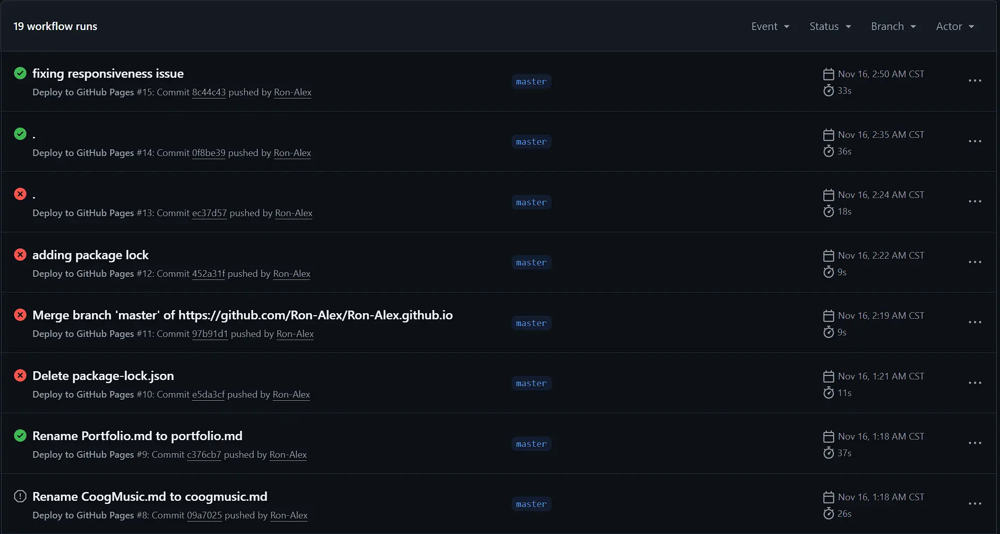
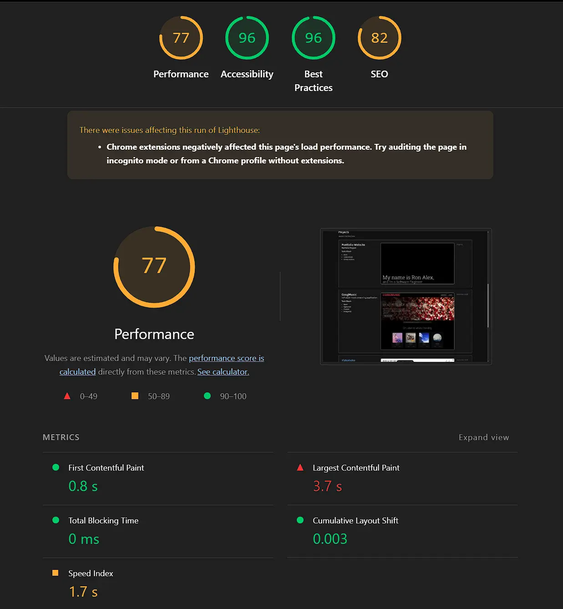
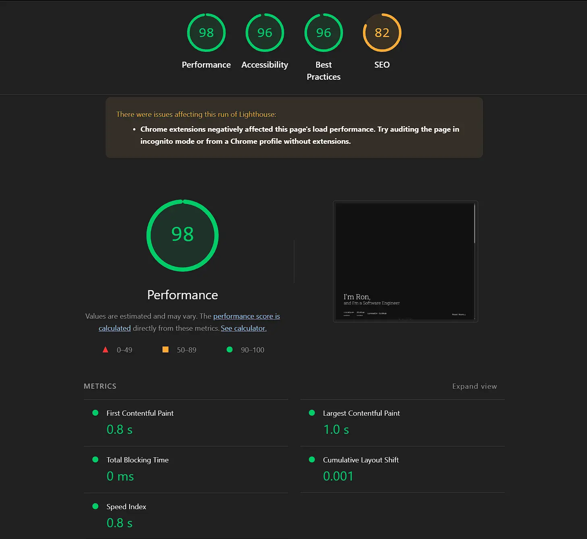
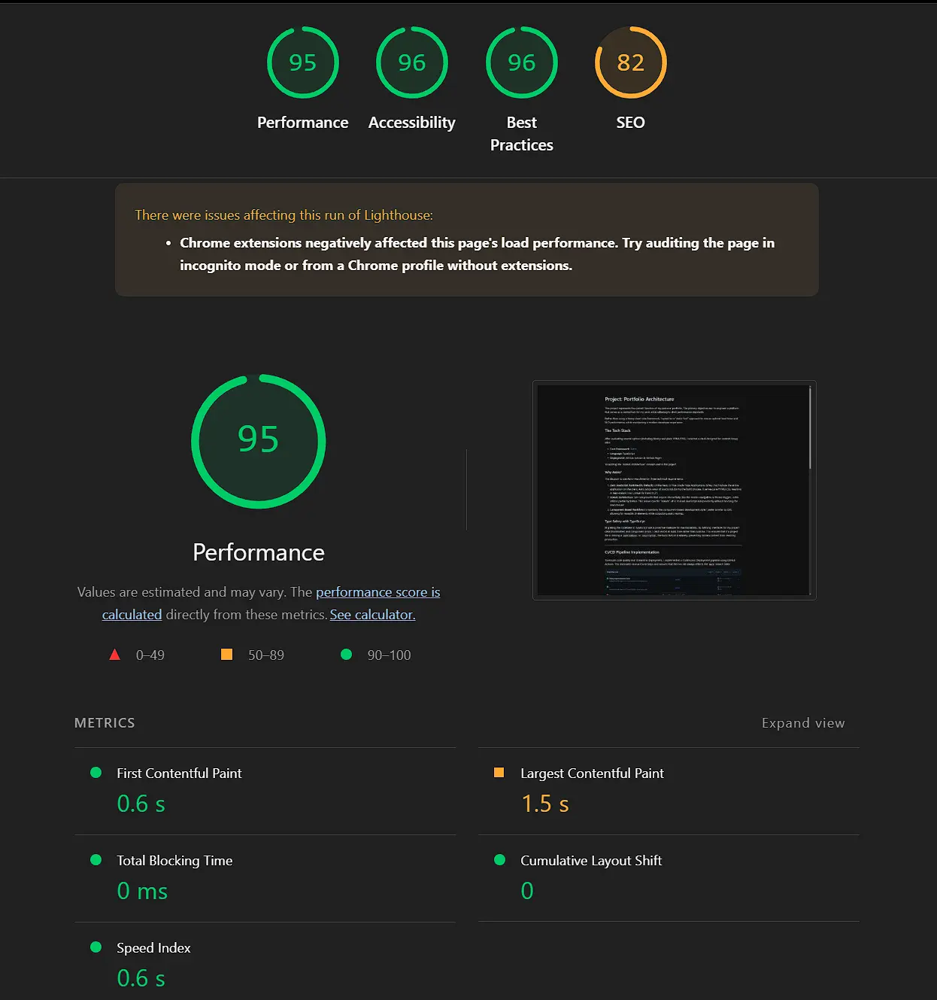

# Project: Portfolio Architecture

This project represents the current iteration of my personal portfolio. The primary objective was to engineer a platform that serves as a central hub for my work while adhering to strict performance standards and responsiveness for multi device compatibility. 

Rather than using a heavy client-side framework, I opted for a "static-first" approach to ensure optimal load times and SEO performance, while maintaining a modern developer experience.

## The Tech Stack

After evaluating several options (including Next.js and plain HTML/CSS), I selected a stack designed for content-heavy sites:

* **Core Framework:** [Astro](https://astro.build/)
* **Language:** TypeScript
* **Deployment:** GitHub Actions & GitHub Pages

*Visualizing the "Islands Architecture" concept used in this project. [Image Source](https://jasonformat.com/islands-architecture/)*

### Why Astro?

The decision to use Astro was driven by three technical requirements:

1.  **Zero-JavaScript Runtime (By Default):** Unlike React or Vue Single Page Applications (SPAs) that hydrate the entire application on the client, Astro strips away all JavaScript during the build process. It serves pure HTML/CSS, resulting in near-instant First Contentful Paint (FCP).
2.  **Islands Architecture:** For components that require interactivity (like the mobile navigation or theme toggle), Astro utilizes partial hydration. This allows specific "islands" of UI to load JavaScript independently without blocking the main thread.
3.  **Component-Based Workflow:** It maintains the component-based development style I prefer (similar to JSX), allowing for reusable UI elements while outputting static markup.

### Type Safety with TypeScript

Migrating the codebase to TypeScript was a proactive measure for maintainability. By defining interfaces for my project data (frontmatter) and component props, I catch errors at build time rather than runtime. This ensures that if a project file is missing a `publishDate` or `description`, the build fails immediately, preventing broken content from reaching production.

---

## CI/CD Pipeline Implementation

To ensure code quality and streamline deployment, I implemented a Continuous Deployment pipeline using GitHub Actions. This eliminates manual build steps and ensures that the live site always reflects the `main` branch state.

*Snapshot of the CI/CD pipeline execution logs.*

The workflow defines a specific set of jobs that run on every push:

1.  **Environment Setup:** Spins up an Ubuntu runner and installs Node.js.
2.  **Dependency Resolution:** Runs `npm ci` (clean install) to ensure deterministic builds based on the lockfile.
3.  **Production Build:** Executes `npm run build` to generate the static assets in the `dist/` directory.
4.  **Deployment:** Uses an action to push the static artifacts directly to the hosting provider.

---

## Performance Optimization & Auditing

A key phase of this project was the performance audit. While the underlying architecture was solid, initial mobile audits for the homepage returned a score of **77**. 

### The Bottleneck
Deep analysis via Chrome DevTools revealed that large unoptimized assets were impacting the Largest Contentful Paint (LCP). I was serving standard PNGs, which significantly increased the payload size on mobile networks.

### The Solution: WebP Conversion
I implemented an image optimization strategy, converting all raster assets to **WebP**. This modern format provides superior lossless and lossy compression for images on the web. 

### The Results
This optimization yielded immediate improvements in load times and raised the homepage score to **98**, aligning it with the high performance of my internal content pages.

*Initial homepage audit (Score: 77) highlighting image weight issues.*

*Post-optimization homepage audit (Score: 98) after switching to WebP.*

*Internal content pages maintain a consistent high performance (Score: 95).*

## Key Takeaways

Building this portfolio provided practical experience in modern static-site generation (SSG) patterns. Key learning outcomes included:

* **Asset Optimization:** Understanding how Astro handles image optimization and bundling automatically versus manual configuration.
* **Pipeline Configuration:** Writing custom YAML workflows for GitHub Actions to handle specific build requirements.
* **State Management:** Managing state in a multi-page application without a global client-side router.

The complete source code and configuration files are available for review on GitHub.

[View Source Code on GitHub](https://github.com/Ron-Alex/Ron-Alex.github.io)